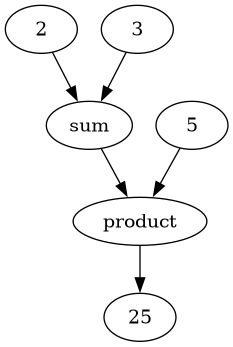

# DAG Computation Engine

A small Python engine for expressing a computation as a graph of connected nodes, evaluating it lazily with memoization, and rendering it as a diagram.



*Generated by the engine itself from the example below.*

## Example

```python
from Atom import Atom
from Value_Emitter import Value_Emitter
import math

three, two, five = Value_Emitter(3), Value_Emitter(2), Value_Emitter(5)

total   = Atom(name="sum",     process=lambda _, inputs: sum(inputs.values()))
product = Atom(name="product", process=lambda _, inputs: math.prod(inputs.values()))

total.input_source_Particles   = {three, two}
product.input_source_Particles = {total, five}

product.emit()   # 25
```

Nodes are wired by declaring their inputs, not by calling one another. Nothing runs until
`emit()` is called, and then only the subgraph that node actually depends on is evaluated.

Run the full demo, which also writes the image above:

```bash
python calculator.py
```

## How it works

**A node is anything shaped like a node.** `Particle` is a `typing.Protocol`, not a base
class: any object exposing `input_source_Particles` and `emit()` satisfies it. Nothing has
to inherit from anything to participate in a graph. This is what lets `Molecule` — a
composite that wraps a whole subgraph behind a single input and output — sit in a graph
beside an `Atom` despite sharing no ancestor with it.

**Evaluation is a memoized depth-first traversal.** `emit()` walks upstream, resolving each
input before computing its own result, and threads a single cache dictionary through the
whole traversal. A node reached twice by different paths is computed once. A node in a
subgraph nobody asked for is never computed at all.

**Cycle detection falls out of the cache.** Before recursing, a node writes an `_IN_PROGRESS`
sentinel into its own cache slot and overwrites it with the real value on the way back out.
Encountering that sentinel means the traversal has re-entered a node it never left — a cycle
— and evaluation raises rather than recursing forever. The cache does double duty as the
visited set, so cycle safety costs no extra bookkeeping.

**Behaviour lives in data.** An `Atom` is a property bag with four privileged keys: `name`,
`value`, `input_source_Particles`, and `process`. `process` is a callable taking the node's
own value and a dict of its resolved inputs, so specialised node types are usually a small
subclass that supplies a `process` and nothing else — `Value_Emitter` is a source that
returns its own value, `Output_Finder` inverts the edge set, `Visualizer` renders to
Graphviz. The graph tooling is itself built out of graph nodes.

## Layout

| File | |
|---|---|
| `Particle.py` | The structural protocol every node satisfies |
| `Atom.py` | Concrete node: property storage, evaluation, cycle detection |
| `Molecule.py` | Composite node wrapping a subgraph as a single unit |
| `Value_Emitter.py` | Source node that emits a constant |
| `Output_Finder.py` | Inverts the input edges to find each node's consumers |
| `Visualizer.py` | Renders a graph to PNG via Graphviz |
| `Registry.py` | Reserved property-name enum |
| `calculator.py` | Runnable demo |

## Requirements

Python 3.10+, `graphviz` (both the Python package and the system `dot` binary; on Debian or
Ubuntu, `apt install graphviz`). Packaged with Nix flakes for reproducible builds.

## Known limitations

- `Atom` and `Molecule` each define their own `_IN_PROGRESS` sentinel. Both are correct in
  isolation because each class only ever tests cache entries it wrote itself, but the
  duplication is fragile and the sentinel belongs in one shared place.
- Cycles raise a bare `Exception`. It should be a dedicated error type callers can catch.
- `Visualizer` writes to a hardcoded `graph.png` rather than an argument.
- Naming deliberately capitalises domain types (`Value_Emitter`, `input_source_Particles`)
  rather than following PEP 8 throughout.

## Credit

This README was written by an AI agent from code written by a human.
